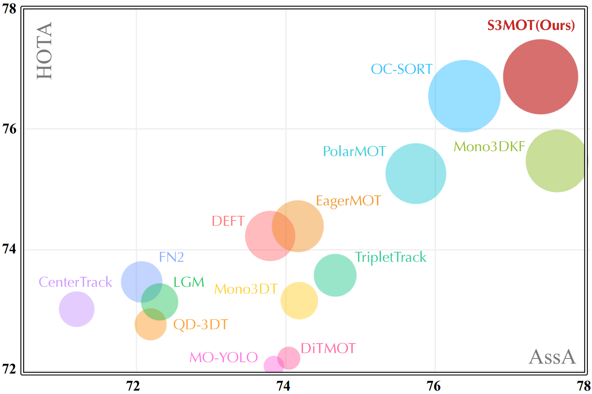

## S3MOT: Monocular 3D Object Tracking with Selective State Space Model
[Install](#installation) // [Datasets](#datasets) // [Experiments](#experiments) //  [Models](#models) // [License](#license)

We will release the source code and model weights soon!

<a target="_blank">

</a>

Official [PyTorch](https://pytorch.org/) implementation of _S3MOT_: **Monocular 3D Object Tracking with Selective State Space Model**

## Installation
To setup your environment, type in a terminal (only tested in Ubuntu 20.04):

### 1. Create and Activate Conda Environment
First, create a new conda environment with Python 3.8 and activate it.

```bash
git clone https://github.com/bytepioneerX/s3mot.git
cd s3mot
conda create -n pys3mot python=3.8
conda activate pys3mot
```

### 2. Install PyTorch 2.3.1 with CUDA 11.8 Support
To install PyTorch 2.3.1 with support for CUDA 11.8, run the following pip command:
```bash
pip install torch==2.3.1 torchvision==0.18.1 torchaudio==2.3.1 --index-url https://download.pytorch.org/whl/cu118
```

### 3. Install Ninja for Faster Compilation
```bash
# Install dependencies
sudo apt install git re2c
# Clone the Ninja repository and build it
git clone https://github.com/ninja-build/ninja.git && cd ninja/
./configure.py --bootstrap
# Move the built binary to /usr/bin and make it executable
sudo cp ninja /usr/bin/
sudo chmod 777 /usr/bin/ninja
# Verify Ninja installation by checking its version
ninja --version
```

### 4. Install Detectron2 from Source
```bash
# Before installing Detectron2, ensure you have the required dependencies. Install them using the following pip command
pip install opencv-python toolz scipy pandas entrypoints==0.3 scikit-learn attrs>=17.4.0
# To install Detectron2 from the source, use the following command
python -m pip install 'git+https://github.com/facebookresearch/detectron2.git'
```

### 5. Install Additional Libraries for our S3MOT
```bash
pip install awscli==1.20.27 boto3==1.18.27 coloredlogs==15.0.1 hydra-core==1.1.1 matplotlib==3.4.3 numpy==1.21.3 pandas==1.3.2
pip install requests==2.26.0 scikit-image==0.18.2 scipy==1.10.1 seaborn==0.11.2 tenacity==8.0.1 tqdm==4.62.2 wandb==0.12.0
# Additionally, install some other specific libraries as follows
pip install numba==0.58.1 Cython==0.29.24 pycocotools==2.0.2 nuscenes-devkit==1.1.7
# Install mpi4py for parallel processing
pip install mpi4py==4.0
# Other necessary libraries
pip install fvcore==0.1.5.post20221221
pip install pytorch3d protobuf==3.20.3
pip install timm==0.4.12
```

### 6. Install causal-conv1d & mamba
```bash
# install causal-conv1d from Wheel file
pip install https://github.com/Dao-AILab/causal-conv1d/releases/download/v1.4.0/causal_conv1d-1.4.0+cu118torch2.3cxx11abiFALSE-cp38-cp38-linux_x86_64.whl
# install mamba from Wheel file
pip install https://github.com/state-spaces/mamba/releases/download/v2.2.2/mamba_ssm-2.2.2+cu118torch2.3cxx11abiFALSE-cp38-cp38-linux_x86_64.whl

```

### 7. Install S3MOT
```bash
bash ./dev/install.sh
```

### Datasets
By default, datasets are assumed to be downloaded in `/data/datasets/<dataset-name>` (can be a symbolic link). The dataset root is configurable by [`DATASET_ROOT`].

#### KITTI
The KITTI 3D dataset used in our experiments can be downloaded from the [KITTI website](http://www.cvlibs.net/datasets/kitti/eval_object.php?obj_benchmark=3d).

The dataset must be organized as follows:

```
<DATASET_ROOT>
    └── KITTI
        ├── testing
        │   ├── calib
        |   │   ├── 000000.txt
        |   │   ├── 000001.txt
        |   │   └── ...
        │   └── image_2
        │       ├── 000000.png
        │       ├── 000001.png
        │       └── ...
        └── training
            ├── calib
            │   ├── 000000.txt
            │   ├── 000001.txt
            │   └── ...
            ├── image_2
            │   ├── 000000.png
            │   ├── 000001.png
            │   └── ...
            └── label_2
                ├── 000000.txt
                ├── 000001.txt
                └── ..
```

## Experiments
### Training
The training script supports (single-node) multi-GPU for training and evaluation via [mpirun](https://www.open-mpi.org/doc/v4.1/man1/mpirun.1.php). 
Internally, `IMS_PER_BATCH` parameters of the optimizer and the evaluator denote the **total** size of batch that is sharded across available GPUs while training or evaluating. They are required to be set as a multuple of available GPUs.
```bash
# Joint Training DD3D and FCOE
./dev/run_dd3d_omninet_kitti.sh --gpus <number>
# Training VeloSSM & HSSM
./dev/run_s3mot_omninet_kitti.sh
```

### Evaluation
One can run only evaluation using the pretrained models:
```bash
./dev/run_dd3d_omninet_kitti.sh --eval
./dev/run_s3mot_omninet_kitti.sh --eval
```

### Models
TBD

### [KITTI Tracking Benchmark](https://www.cvlibs.net/datasets/kitti/eval_tracking_detail.php?result=9110d087be70be0f77a90bb25fe3a92627ecfb0c)
| **Method**     | **Modality**   | **Mode** | **HOTA↑** | **DetA↑** | **AssA↑** | **DetRe↑** | **AssRe↑** | **LocA↑** | **MOTA↑** | **FPS ↑** |
| :---:          | :---:          | :---:    | :---:     | :---:     | :---:     | :---:      | :---:      | :---:     | :---:     | :---:     |
| Quasi-Dense    | Camera         | 2D       | 68.45     | 72.44     | 65.49     | 76.01      | 68.28      | 86.50     | 84.93     | 16        |
| AB3DMOT        | LiDAR          | 3D       | 69.99     | 71.13     | 69.33     | 75.66      | 72.31      | 86.85     | 83.61     | 215       |
| QD-3DT         | Camera         | 3D       | 72.77     | 74.09     | 72.19     | 78.13      | 74.87      | 87.16     | 85.94     | 6         |
| CenterTrack    | Camera         | 3D       | 73.02     | 75.62     | 71.20     | 80.10      | 73.84      | 86.52     | 88.83     | 22        |
| Mono3DT        | Camera         | 3D       | 73.16     | 72.73     | 74.18     | 76.51      | 77.18      | 86.88     | 84.28     | 33        |
| TripletTrack   | Camera         | 3D       | 73.58     | 73.18     | 74.66     | 76.78      | 77.31      | 87.37     | 84.32     | -         |
| DEFT           | Camera         | 3D       | 74.23     | 75.33     | 73.79     | 79.96      | 78.30      | 86.14     | 84.38     | 13        |
| EagerMOT       | Camera/LiDAR   | 3D       | 74.39     | 75.27     | 74.16     | 78.77      | 76.24      | 87.17     | 87.82     | 90        |
| PolarMOT       | LiDAR          | 3D       | 75.16     | 73.94     | 76.95     | 80.81      | 80.00      | 87.12     | 85.08     | 170       |
| OC-SORT        | Camera         | 2D       | 76.54     | 77.25     | 76.39     | 80.64      | 80.33      | 87.01     | **90.28** | **793**   |
| S3MOT (Ours)   | Camera         | 3D       | **76.86** | **76.95** | **77.41** | **83.79**  | **81.01**  | **87.87** | 86.93     | 31        |



## License
The source code is released under the [MIT license](LICENSE.md). We note that some code in this repository is adapted from the following repositories:
- [detectron2](https://github.com/facebookresearch/detectron2)
- [AdelaiDet](https://github.com/aim-uofa/AdelaiDet)
- [DD3D](https://github.com/TRI-ML/dd3d)
- [VMamba](https://github.com/MzeroMiko/VMamba)